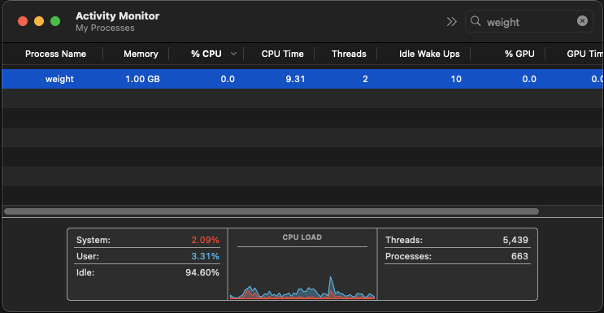

# weight

Puts weight on system resources such as memory and soon CPU and disk.

This can be used for testing and troubleshooting purposes. For example it can be used to see if a computer can handle a given amount of memory usage or if a cluster scales up based on CPU usage.

## Usage

You can use the `-h` or `--help` switch to get a list of all available sub-commands and arguments.

Write 1GB of data in memory and wait for 10 seconds before exiting
```shell
weight --memory 1GB --wait 10
```

```
Writing 1GB of memory...
Continuously modifying 1GB = 1073741824B of memory.
Waiting for 10 seconds before exiting.
Exiting after waiting for 10 seconds.
```



## Todo

* Support putting weight on CPU
* Support putting weight on disk
